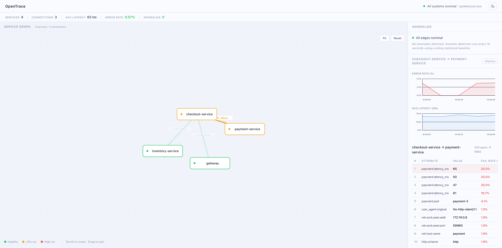

# OpenTrace

An open-source observability platform that automatically maps how your microservices talk to each other, detects anomalies in real time, and performs root-cause analysis on failures — all from a single dashboard.

[](LICENSE)
[](https://opentelemetry.io)



## What it does

- **Service graph** — automatically discovers every service-to-service connection from live traffic. No manual config, no service registry. Any service that sends an OpenTelemetry trace appears as a node within seconds.
- **Anomaly detection** — maintains a rolling statistical baseline per edge. Flags error rate or latency spikes within 10 seconds using z-score detection.
- **Root-cause analysis** — when an anomaly fires, compares span attributes between failed and succeeded requests to surface the discriminating factor (e.g. `upstream_cluster=payment-2` has a 94% failure rate vs 2% for all other upstreams).
- **Time-series charts** — 30-minute history of error rate and latency per edge, stored in ClickHouse.
- **Works with any app** — uses OpenTelemetry, the open standard. SDKs exist for every major language and framework.

## Quick start

**Requirements:** Docker and Docker Compose. Ports `3000`, `4319`, `16686` must be free.

```bash
git clone https://github.com/dasuntheekshanadev/open-trace.git
cd open-trace
docker compose up --build
```

Open **http://localhost:3000**

A demo app (4 Go microservices: `gateway → checkout → payment + inventory`) starts automatically and generates traffic. Within 30 seconds the service graph populates.

### Simulate a failure

```bash
# Inject errors into the payment service
curl -X POST http://localhost:8082/admin/fault -d '{"mode":"always-fail"}'

# OpenTrace detects the anomaly within ~30 seconds and highlights the edge

# Reset to normal
curl -X POST http://localhost:8082/admin/fault -d '{"mode":"none"}'
```

## Connect your own app

Point any OpenTelemetry-instrumented app at the collector:

```
OTLP endpoint: http://<your-host>:4319
Protocol:      HTTP/protobuf
```

### Node.js

```bash
npm install @opentelemetry/sdk-node @opentelemetry/exporter-trace-otlp-http
```

```js
const { NodeSDK } = require('@opentelemetry/sdk-node');
const { OTLPTraceExporter } = require('@opentelemetry/exporter-trace-otlp-http');

const sdk = new NodeSDK({
  serviceName: 'my-service',
  traceExporter: new OTLPTraceExporter({
    url: 'http://localhost:4319/v1/traces',
  }),
});
sdk.start();
```

### Python

```bash
pip install opentelemetry-sdk opentelemetry-exporter-otlp-proto-http
```

```python
from opentelemetry import trace
from opentelemetry.sdk.trace import TracerProvider
from opentelemetry.sdk.trace.export import BatchSpanProcessor
from opentelemetry.exporter.otlp.proto.http.trace_exporter import OTLPSpanExporter

provider = TracerProvider()
provider.add_span_processor(
    BatchSpanProcessor(OTLPSpanExporter(endpoint="http://localhost:4319/v1/traces"))
)
trace.set_tracer_provider(provider)
```

### Go

```go
import (
    "go.opentelemetry.io/otel/exporters/otlp/otlptrace/otlptracehttp"
    "go.opentelemetry.io/otel/sdk/trace"
)

exporter, _ := otlptracehttp.New(ctx,
    otlptracehttp.WithEndpoint("localhost:4319"),
    otlptracehttp.WithInsecure(),
)
tp := trace.NewTracerProvider(trace.WithBatcher(exporter))
otel.SetTracerProvider(tp)
```

For more detail see **[docs/integration.md](docs/integration.md)**.

## Architecture

```
Your App  ──OTLP HTTP──►  Collector (Go)  ──►  ClickHouse
                               │                (span + metric history)
                               │
                    ┌──────────┼──────────┐
                    ▼          ▼          ▼
               Graph        Anomaly    Root-Cause
               Builder      Detector   Analyzer
               (in-mem)    (rolling    (attribute
                            z-score)    skew)
                    └──────────┼──────────┘
                               ▼
                            REST API
                               │
                    ┌──────────┴──────────┐
                    ▼                     ▼
             Dashboard              Jaeger UI
           (React + D3)          (full traces)
          localhost:3000         localhost:16686
```

| Component | Description |
|---|---|
| `collector/` | Go service — OTLP receiver, in-memory graph, anomaly detection, root-cause API |
| `frontend/` | React + TypeScript + D3.js dashboard |
| `sample-app/` | Demo Go microservices for local testing |
| ClickHouse | Column-store for span and edge metric history |
| Jaeger | Full distributed trace viewer (runs alongside, optional) |

## How anomaly detection works

For each service-to-service edge, the detector maintains a rolling window of 30 ten-second buckets (5 minutes of baseline). Every 10 seconds it computes a z-score for the current bucket:

```
z = (current_value - baseline_mean) / baseline_stddev
```

- **Error rate** fires at z > 2.5σ
- **Latency** fires at z > 2.5σ

Buckets with fewer than 5 calls are skipped to avoid noise from low-traffic edges. When an anomaly fires, the root-cause analyzer queries ClickHouse for the last 30 minutes of spans on that edge and ranks attributes by how much more often they appear in failing requests than healthy ones.

## Requirements

- Docker and Docker Compose
- Open ports: `3000` (dashboard), `4319` (OTLP receiver), `16686` (Jaeger UI, optional), `8123` (ClickHouse, internal)

## Contributing

See [CONTRIBUTING.md](CONTRIBUTING.md).

## License

[MIT](LICENSE) — © 2026 Dasun Theekshana
